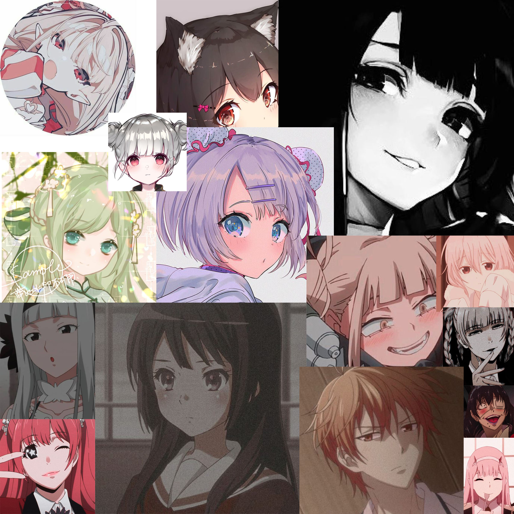

# Anime-Face-Dataset

The highest quality public anime face dataset. Contains roughly 4000 images.

Data is scraped from Pinterest, from boards for "Anime Icons," containing many images of cropped photos of anime faces.

Icons may be stylized with filters and other effects, decreasing the quality of the data.

## Sample Images:
<p align="center">

<\p>

Dataset can be found [here](https://www.kaggle.com/datasets/dungwoong/anime-icons-dataset). Inspiration for this dataset was drawn from [this repo](https://github.com/bchao1/Anime-Face-Dataset).

## Disclaimer:
This dataset should only be used for educational/research purposes. I noticed that anime datasets tend to have older art styles, and lower quality art, and thus, I am providing a small dataset of "newer" screenshots and digital portraits for better judgement of model performance. I intend to investigate few-shot learning, and efficient architectures, and honestly can't be asked to scrape more data, so the amount of data is limited. This dataset is ideal for transfer learning.

I do not own the rights to any of these works. If you have any issues with the datasets, please submit an issue or something and I can take down the dataset.

## Data overview
Data may have various crops/filters/other effects used on them. Dataset is scraped from various Pinterest boards with no further preprocessing.

## Citation
If you use the scripts in this repo or the data in this dataset, I would appreciate if you cite it.

```
@online{chao2019/online,
  author       = {Kevin Wang},
  title        = {Anime Icon Dataset},
  date         = {2023-02-16},
  year         = {2023},
  url          = {https://github.com/dungwoong/Anime-Face-Dataset}
}
```
